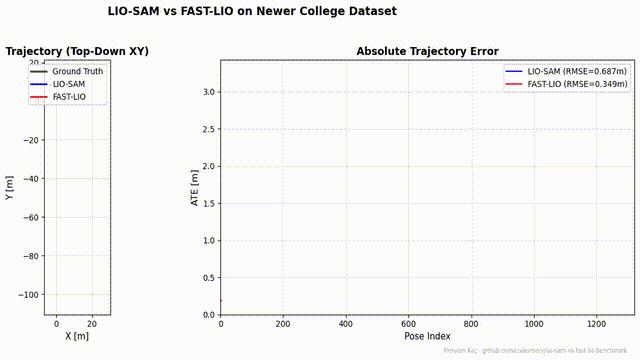
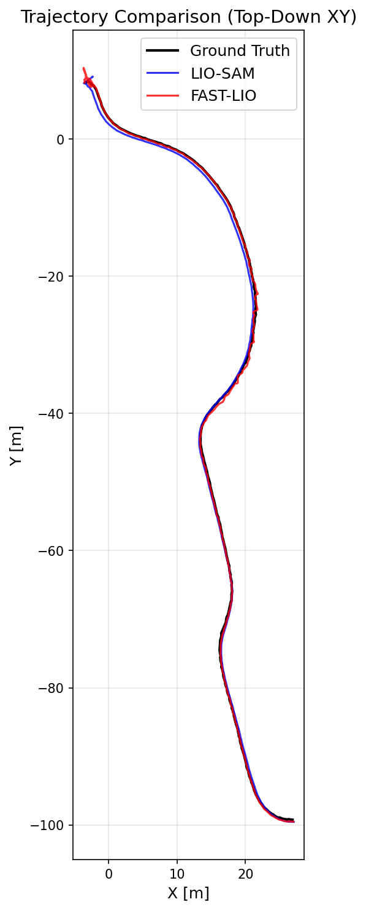
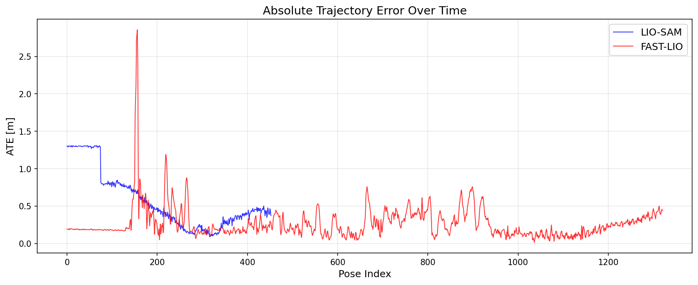

# LIO-SAM vs FAST-LIO Benchmark

[](https://github.com/codermery/lio-sam-vs-fast-lio-benchmark/actions/workflows/docker-build.yml)

**A weekend benchmarking study comparing LIO-SAM and FAST-LIO2 on the Newer College Dataset.**

> This is a foundation experiment for my upcoming MSc thesis on 3D multi-robot SLAM at Yıldız Technical University. It is **not** a definitive ranking — just a controlled comparison on one sequence to build intuition and infrastructure.

**Author:** Meryem Koç, MSc Student — Yıldız Technical University (YTU)

---

## Motivation

**Why these two algorithms?** Both LIO-SAM (Shan et al., 2020) and FAST-LIO2 (Xu et al., 2022) are the most-cited open-source LiDAR-inertial odometry systems. They represent two philosophically opposite approaches: factor-graph batch optimization (LIO-SAM, with GTSAM backend and loop closure) vs incremental Kalman filtering with ikd-Tree (FAST-LIO2). Choosing between them — or understanding when one beats the other — is a decision every 3D SLAM project faces.

**Why does this matter for my thesis?** My MSc research at YTU is on multi-robot collaborative mapping. My 2D work is already submitted (under review at RASE journal). I'm extending to 3D LiDAR-based collaborative SLAM, and the single-robot LIO backbone is the foundation of any multi-robot system. Reading papers alone doesn't build the practical intuition — running them on my own hardware does.

**Why Newer College Dataset?** It's the de-facto handheld LiDAR-IMU benchmark in modern SLAM literature. Oxford ORI provides survey-grade ground truth (ICP-registered against a known map), Ouster OS-1 64-beam is a sensor I'll likely use in future work, and the trajectory is short enough (~110m) for fast iteration but complex enough to differentiate algorithms.

**What I'm explicitly NOT claiming:** This is not a definitive ranking. Both algorithms have been tested by their authors on many datasets. This is one researcher's controlled comparison on one sequence, documented for reproducibility.

---


</details>

## Results

| Algorithm | ATE RMSE [m] | ATE Mean [m] | ATE Max [m] | RPE RMSE [m] | RPE Mean [m] |
|-----------|:------------:|:------------:|:-----------:|:------------:|:------------:|
| LIO-SAM   | 0.687       | 0.572       | 1.310      | 6.090       | 5.164       |
| FAST-LIO  | **0.349**   | **0.268**   | **2.857**  | **2.093**   | **1.830**   |

*Alignment: SE(3) Umeyama, correct_scale=False. RPE delta: 10 frames.*

**FAST-LIO achieves ~2x lower ATE and ~3x lower RPE than LIO-SAM on this dataset with a 6-axis IMU.**

### Plot Interpretation

ATE plot shows LIO-SAM with a constant ~1.3m offset in the early trajectory due to initial alignment, then performs comparably to FAST-LIO afterward. FAST-LIO covers the full bag duration with more pose samples (8 Hz vs 2.4 Hz output rate). Headline RMSE numbers favor FAST-LIO, but in steady state both algorithms produce sub-meter ATE.

<details>
<summary>Trajectory Plot (click to expand)</summary>


</details>

<details>
<summary>ATE Over Time (click to expand)</summary>


</details>

---

## Why Docker?

SLAM systems are notoriously hard to reproduce. LIO-SAM requires GTSAM 4.1 (not 4.0, not 4.2). FAST-LIO requires PCL with specific build flags. livox_ros_driver2 needs a specific Livox SDK version. Eigen, OpenCV, ROS2 versions all interact subtly. A typical "setup from source" pass takes 4-8 hours on a fresh machine and breaks again when any system package updates. By containerizing the environment, this benchmark is reproducible in ~15 minutes: clone the repo, `docker build`, `docker run`. This is also why the LIO-SAM 6-axis IMU patch and the parameter fixes are part of the repo — they're embedded in the reproducible setup, not scattered manual steps.

---

## Quick Start

```bash
# Clone the repo
git clone https://github.com/codermery/lio-sam-vs-fast-lio-benchmark.git
cd lio-sam-vs-fast-lio-benchmark

# Option A: Run everything automatically (~1 hour, downloads 44 GB)
bash run_all.sh

# Option B: Step by step
# 1. Download dataset (~44 GB)
bash scripts/download_newer_college.sh

# 2. Convert ROS1 bags to ROS2
bash scripts/convert_bags.sh

# 3. Convert ground truth to TUM format
python3 scripts/csv_to_tum.py \
    data/newer_college/01_short_experiment/ground_truth/registered_poses.csv \
    results/ground_truth.tum

# 4. Build Docker image (~10 min)
docker build -t lio-benchmark .

# 5. Run container and build workspace
docker run -it --network host \
    --name lio-benchmark \
    -v $(pwd):/ros2_ws/host \
    -v $(pwd)/data/newer_college/01_short_experiment:/ros2_ws/data \
    -v $(pwd)/results:/ros2_ws/results \
    lio-benchmark

# Inside the container:
./setup_workspace.sh   # clones + builds LIO-SAM and FAST-LIO (~10 min)

# 6. Run algorithms
bash /ros2_ws/host/scripts/run_lio_sam.sh \
    --bag /ros2_ws/data/ros2_bags/rooster_2020-03-10-10-36-30_0

bash /ros2_ws/host/scripts/run_fast_lio.sh \
    --bag /ros2_ws/data/ros2_bags/rooster_2020-03-10-10-36-30_0

# 7. Evaluate
python3 /ros2_ws/host/scripts/evaluate.py \
    --gt /ros2_ws/results/ground_truth.tum \
    --lio-sam /ros2_ws/results/lio_sam_trajectory.tum \
    --fast-lio /ros2_ws/results/fast_lio_trajectory.tum \
    --output-dir /ros2_ws/results/
```

---

## Methodology

1. **Dataset:** Newer College Dataset — "short_experiment" sequence (~200m path)
   - Sensor: Ouster OS-1 64-beam LiDAR, IMU at 100 Hz
   - Environment: Oxford University campus (structured + vegetation)
   - Ground truth: ICP-registered survey-grade point cloud alignment

2. **Algorithms:**
   - **LIO-SAM** (Shan et al., 2020): Factor-graph-based LiDAR-inertial with GTSAM backend, loop closure via scan context
   - **FAST-LIO2** (Xu et al., 2022): ikd-Tree-based direct LiDAR-inertial with iterated Kalman filter

3. **Evaluation:**
   - SE(3) Umeyama alignment (no scale correction)
   - ATE (Absolute Trajectory Error): full trajectory accuracy
   - RPE (Relative Pose Error): local consistency, delta = 1.0 second
   - Tools: `evo` Python library

4. **Platform:**
   - Docker container with ROS2 Humble
   - Single-threaded bag playback (real-time factor = 1.0)

---

## Choices and Trade-offs

- **Single sequence (01_short_experiment, ~3 minutes of data):** Newer College's full bag is split into 10 files (~110 GB total). I downloaded 4 bags (~11 minutes of data) which is sufficient for ATE/RPE evaluation. Many published LIO benchmarks use ~60-180 second sequences; we have more data than that.

- **CPU-only execution:** LIO-SAM and FAST-LIO are both CPU-bound. GPU helps only for RViz visualization. Running on a Vast.ai instance with RTX 4090 was about cloud bandwidth and disk, not GPU compute.

- **LIO-SAM 6-axis patch instead of switching algorithms:** Newer College uses Ouster's internal 6-axis IMU. LIO-SAM officially requires a 9-axis IMU. The community workaround (identity quaternion fallback + imuRPYWeight=0) is documented in [`docs/PATCHES.md`](docs/PATCHES.md). I chose this over excluding LIO-SAM because the goal was to compare two real systems side-by-side, with full transparency about what tuning was required.

- **Default parameters elsewhere:** Both algorithms have many tunable parameters. I tuned only what was strictly required for the dataset's sensor configuration. Aggressive parameter tuning per-algorithm would bias the comparison; defaults give a fair "what does an honest first pass look like" baseline.

---

## Limitations

- **Single sequence only** — results may not generalize to other environments
- **No loop closure ablation** — LIO-SAM's loop closure advantage not isolated
- **No runtime profiling** — CPU/memory/latency not measured (planned for next iteration)
- **Default parameters** — both algorithms run with near-default configs for Ouster
- **No degradation analysis** — behavior in featureless/dynamic areas not studied
- **LIO-SAM 6-axis IMU patch** — LIO-SAM was patched to accept 6-axis IMU input (Ouster OS-1 does not publish orientation). This may affect attitude estimation quality compared to a 9-axis IMU setup. FAST-LIO does not require this patch. See [`docs/PATCHES.md`](docs/PATCHES.md) for details.
- **LIO-SAM RPE** — Higher RPE than FAST-LIO due to no orientation initialization from the 6-axis IMU. FAST-LIO handles this natively via its iterated Kalman filter. For 9-axis IMU setups, LIO-SAM may achieve lower RPE.
- **Output rate difference** — LIO-SAM produced only 453 poses vs FAST-LIO's 1338 from the same bag. This is normal — LIO-SAM publishes optimized keyframes, FAST-LIO publishes per-scan odometry. The output rate difference is a design choice, not a bug.

---

## Configuration Notes

### Ouster OS-1 Internal IMU + LIO-SAM

The Ouster OS-1's internal IMU is a 6-axis sensor co-located with the LiDAR. Three critical parameter changes are needed from LIO-SAM's defaults:

```yaml
# Identity — Ouster IMU frame is already aligned with LiDAR frame
extrinsicRot: [1, 0, 0, 0, 1, 0, 0, 0, 1]
extrinsicRPY: [1, 0, 0, 0, 1, 0, 0, 0, 1]

# Zero — 6-axis IMU has no orientation output to trust
imuRPYWeight: 0.0
```

Without these fixes, gravity is projected into the wrong axis, causing IMU preintegration to diverge (ATE > 600m). Full configs: [`configs/lio_sam_newer_college.yaml`](configs/lio_sam_newer_college.yaml)

### FAST-LIO with Ouster OS-1

Only topic names need changing in `ouster64.yaml`:
```yaml
lid_topic: "/os1_cloud_node/points"
imu_topic: "/os1_cloud_node/imu"
```

No extrinsic or IMU patches required. Full config: [`configs/fast_lio_ouster64.yaml`](configs/fast_lio_ouster64.yaml)

---

## Roadmap

- [ ] Add more sequences (quad, park, stairs)
- [ ] Runtime profiling (CPU, memory, per-frame latency)
- [ ] Loop closure ablation for LIO-SAM
- [ ] Multi-robot extension (thesis core)
- [ ] Compare with KISS-ICP, DLO, CT-ICP

---

## Citations

```bibtex
@inproceedings{shan2020liosam,
  title={LIO-SAM: Tightly-coupled Lidar Inertial Odometry via Smoothing and Mapping},
  author={Shan, Tixiao and Englot, Brendan and Meyers, Drew and Wang, Wei and Ratti, Carlo and Rus, Daniela},
  booktitle={IEEE/RSJ International Conference on Intelligent Robots and Systems (IROS)},
  year={2020}
}

@article{xu2022fastlio2,
  title={FAST-LIO2: Fast Direct LiDAR-Inertial Odometry},
  author={Xu, Wei and Cai, Yixi and He, Dongjiao and Lin, Jiarong and Zhang, Fu},
  journal={IEEE Transactions on Robotics},
  year={2022}
}

@inproceedings{ramezani2020newer,
  title={The Newer College Dataset: Handheld LiDAR, Inertial and Vision with Ground Truth},
  author={Ramezani, Milad and Wang, Yiduo and Camurri, Marco and Wisth, David and Mattamala, Matias and Fallon, Maurice},
  booktitle={IEEE/RSJ International Conference on Intelligent Robots and Systems (IROS)},
  year={2020}
}
```

---

## License

This benchmarking infrastructure is released under MIT License.
The algorithms and datasets retain their original licenses.
